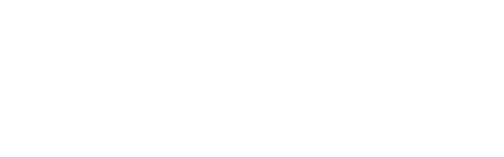

# Angular Template

## Author

**Cesar Vargas** - [@CesarVargasDev](https://github.com/CesarVargasDev)

Ensure you have the following installed:

- [Node.js](https://nodejs.org/) (version Compatible with Angular CLI version >= 18) (LTS recommended)
- [Angular CLI](https://angular.io/cli) (version >= 18)

The primary objective of this project is to offer a foundational template for building production-ready web applications using Angular. 
This template aims to eliminate the repetitive task of configuring all necessary tools for each new project, allowing developers to concentrate on the important tasks.

Just fork and open a pull request with your changes. All contributions are welcome!

## TODO
[TODO](TODO.md)

## License

MIT @ [@CesarVargasDev](https://github.com/CesarVargasDev). 
